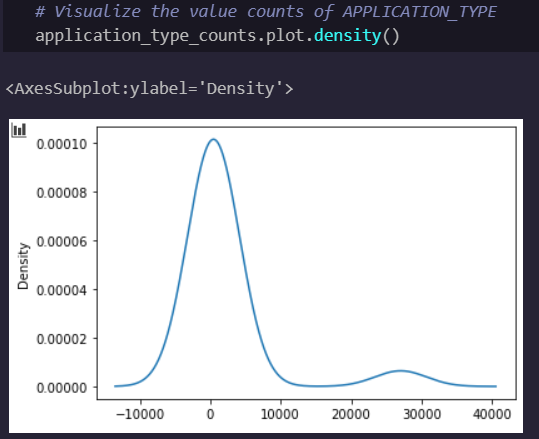
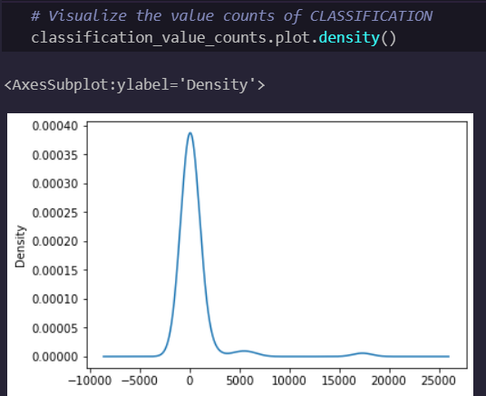

# Neural_Network_Charity_Analysis
## Overview
The purpose of this analysis is to determine which charitable donations from Alphabet Soup will be successful using neural network binary classification.

We will preprocess the data, compile a model, and optimize the model.

## Results
### Data Preprocessing

The target for our model is the `'IS_SUCCESSFUL'` column.  The input features are `['STATUS', 'ASK_AMT', 'APPLICATION_TYPE', 'INCOME_AMT', 'SPECIAL_CONSIDERATIONS']`.  We don't need the `'EIN'` or `'NAME'` column, hence they are dropped.

### Compiling, Training, and Evaluating the Model

The neural network has one input layer with eighty nodes, one hidden layer with thirty nodes, and the output layer has one node.  The output layer has a sigmoid activation function, and the othersuse relU.  I was not able to achieve the target model performance.  I tried varying the number of hidden layers, the number of nodes in each layer, and the activation functions of each layer.  I suspect the defect was in the data itself, and more thorough preprocessing and EDA is required.

## Summary

The model achieves an accuary of 69%, which is well below what would be considered desireable for predicting success of charitable donations.  More EDA and cleaning of the data is likely required.  The two density plots shown below are polymodal, and this is likely causing issues with the deep learning algorithm.  In a new analysis, we would likely need to bin the data differently or remove noisy data points.

